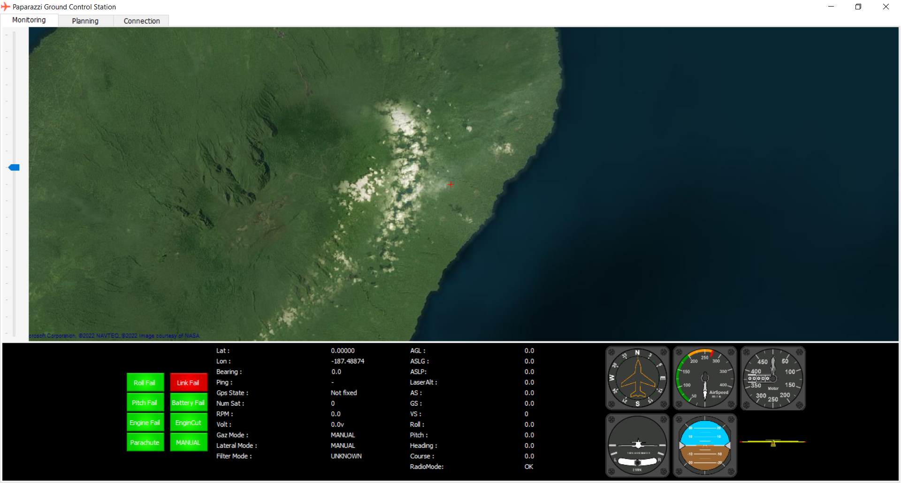

# PaparazziWinGCS

This is a Windows-based Paparazzi GCS which has written by Visual C# 2013.
Some features of this project:

 - Using XML files which generated by original Paparazzi project, to parse messages and creating setting menu items and flight plane blocks.
 - Ability to record/playback flights.
 - Ability to convert UAV internal log to CSV file and analyzing its data.
 - Ease to develop and extend messages
 - Ease to put waypoints and moving them
---
Used gauges:
https://www.codeproject.com/Articles/27411/C-Avionic-Instrument-Controls

Main Paparazzi Project:
https://github.com/paparazzi

\* *I just changed some components and minor changes on its UI.*

